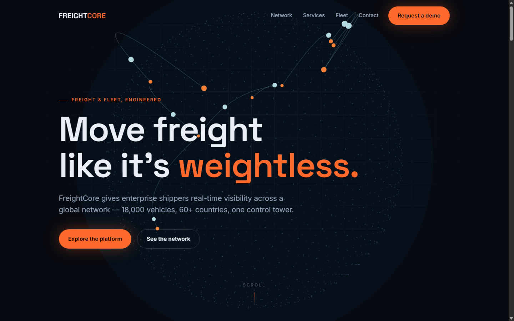

# FreightCore Logistics

A single-page, scroll-driven **hero experience** for a fictional enterprise freight & fleet
brand. Built as a take-home for the Truckinzy Full-Stack Developer Intern assignment.

**Stack:** Vite · React 18 · Three.js (react-three-fiber) · GSAP ScrollTrigger · Lenis smooth scroll



> Live demo: https://assignment-website-one.vercel.app/

---

## What's in it

| Requirement                        | Where it lives                                                                                                                                |
| ---------------------------------- | --------------------------------------------------------------------------------------------------------------------------------------------- |
| Hero + 3 content sections + footer | `Hero`, `Stats`, `Services`, `Fleet`, `Footer`                                                                                                |
| GSAP ScrollTrigger sequence        | **Pinned, scrubbed service reveal** (`Services.jsx`) + **pinned horizontal scroll** (`Fleet.jsx`) + scroll-mapped stat counters (`Stats.jsx`) |
| WebGL / Three.js canvas            | `three/GlobeScene.jsx` — dotted globe, animated great-circle freight lanes with travelling shipments, cursor parallax                         |
| Responsive (mobile/tablet/desktop) | CSS-module breakpoints in every component                                                                                                     |
| Loading state (bonus)              | `Preloader.jsx` — counts to 100, curtains up                                                                                                  |
| Deployed live                      | Vercel (see below)                                                                                                                            |

## Highlights

- **Two distinct ScrollTrigger techniques** — a pinned/scrubbed panel crossfade _and_ a
  pinned horizontal scroll — plus scroll-triggered count-up stats.
- **60fps-minded WebGL** — capped `dpr`, software-friendly geometry counts, a single shared
  animation loop, and a cursor-parallax that lerps instead of snapping.
- **Lenis + GSAP share one RAF loop**, so smooth scrolling and ScrollTrigger never fight over
  the scroll position.
- **Code-split 3D runtime** — the ~180KB (gzip) Three.js bundle is lazy-loaded so the hero
  copy paints immediately (LCP ~0.7s).
- **Accessible defaults** — honours `prefers-reduced-motion` (disables Lenis + heavy motion),
  semantic landmarks, keyboard-reachable nav.

## Getting started

```bash
npm install
npm run dev        # http://localhost:5173
npm run build      # production build -> dist/
npm run preview    # serve the production build locally
```

Requires Node 18+.

## Project structure

```
src/
  components/
    Preloader.jsx        # brand loading state
    Navbar.jsx           # sticky nav + mobile drawer
    Hero.jsx             # headline + lazy-loaded WebGL globe
    Stats.jsx            # scroll-triggered animated counters
    Services.jsx         # PINNED + scrubbed panel reveal (flagship ScrollTrigger)
    Fleet.jsx            # PINNED horizontal-scroll cards
    Footer.jsx           # CTA band + footer
    three/
      GlobeScene.jsx     # react-three-fiber scene
    *.module.css         # component-scoped styles
  hooks/
    useSmoothScroll.js   # Lenis <-> GSAP ticker bridge
  lib/
    gsap.js              # single ScrollTrigger registration
  styles/
    index.css            # design tokens, reset, utilities
```
## Notes

FreightCore Logistics is a **fictional brand** built purely for this assignment. All copy,
stats, and "freight lanes" are illustrative.
